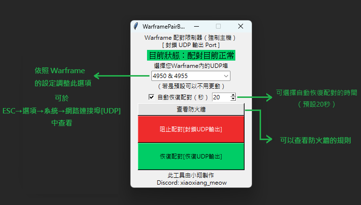

# **WarframePairBlockTool**

  

透過限制特定 UDP 端口輸出來強制成為主機，避免加入其他玩家的主機，確保你成為遊戲的主機。

> 若你想要在開放世界成為主機，你只要先將隊伍調整成非公開，進入載入的期間調整成公開即可，不必依賴此工具。

## 📥 **下載**

👉 [**Windows 執行檔 點我下載**](https://github.com/MeowXiaoXiang/WarframePairBlockTool/releases/download/v2.3/WarframePairBlockTool.exe "下載 v2.3 版本")

## 📋 **功能特色**

- **封鎖 UDP 4950 和 4955**：自動阻斷遊戲的配對請求，讓伺服器無法找到其他主機並將你設為主機。
- **自動解除封鎖**：預設 20 秒後解除封鎖，避免長時間阻斷影響 P2P 連線的穩定性。你可以在工具中**自訂封鎖時間**，根據需求進行調整。
- **自動請求系統管理員權限**： 工具啟動時會自動請求系統管理員權限，以便修改防火牆規則來封鎖指定端口。

## 🚀 **如何使用**

1. **啟動工具**：

   - 雙擊 `WarframePairBlockTool.exe`，工具會自動請求系統管理員權限以修改防火牆規則。
2. **開始封鎖**：

   - 點擊「**開始**」按鈕，阻斷 UDP 4950 和 4955，確保你成為主機。
3. **自動解除封鎖**：

   - 預設封鎖 20 秒後自動解除。你也可以在工具中調整所需的封鎖時間。

## 🛠️ **打包說明**

1. **安裝 PyInstaller**：在終端機中執行以下指令：

   ```bash
   pip install pyinstaller
   ```
2. **打包程式**：在 `main.py` 所在的目錄下輸入以下指令：

   ```bash
   pyinstaller -F -w main.py
   ```

   - **`-F`**：將程式打包為單一執行檔
   - **`-w`**：隱藏終端機視窗 (Windows)
3. **查看打包結果**：
   打包完成後，檔案會存放於 `dist` 資料夾內。

## 🖼️ **使用介面示意圖**



## ❓ **常見問題與注意事項**

1. **無法成為主機？**
   - 確保工具成功封鎖 UDP 4950 和 4955。
   - 確認你的系統允許遊戲的 P2P 連線。

2. **封鎖後看不到其他玩家？**
   - 過長的封鎖時間可能導致同步問題。
   - 使用工具的**自動回復配對**功能來避免此問題。

3. **防毒軟體阻擋執行檔？**
   - 若遇到防毒軟體警告，將工具加入信任清單即可。

## 🤝 **貢獻與支援**

若有任何問題或建議，請在 GitHub 上提交 Issue 或 Pull Request。
