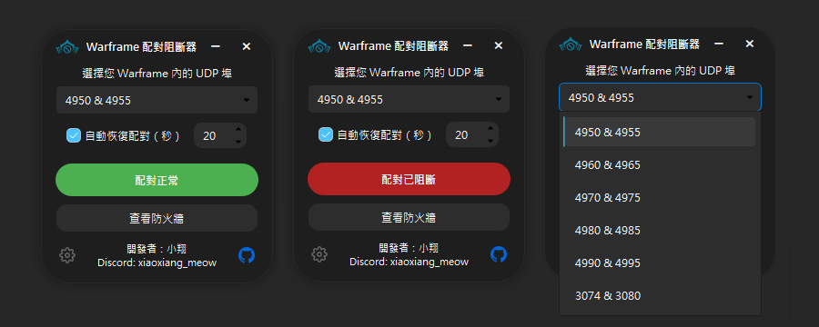
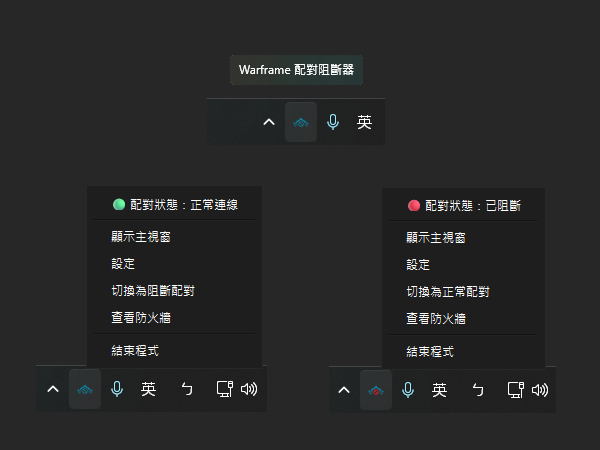
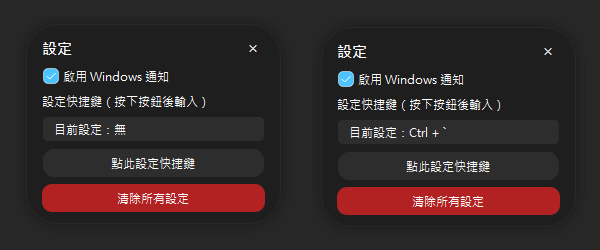
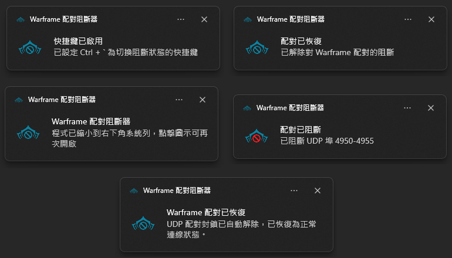

# Warframe 配對阻斷器

版本歷程請見 [變更紀錄](CHANGELOG.md)。

  

透過 Windows 防火牆暫時阻斷所選的 UDP 埠，降低加入其他玩家主機的機會。實際主機分配仍由遊戲決定。

> 若你想要在開放世界成為主機，你只要先將隊伍調整成非公開，進入載入的期間調整成公開即可，不必依賴此工具。

## 下載

[下載 Windows 執行檔 v3.0.0](https://github.com/MeowXiaoXiang/WarframePairBlockTool/releases/download/v3.0.0/WarframePairBlockTool.exe)

[變更紀錄](CHANGELOG.md)中「尚未發布」的修改尚未包含在上述 v3.0.0 下載檔中。

## 功能特色

- **PySide6 介面**：使用 PySide6 建立主視窗、設定視窗與托盤選單
- **系統列支援**：關閉主視窗時隱藏至右下角系統托盤，可從托盤重新開啟
- **快捷鍵支援**：可設定全局快捷鍵快速切換配對狀態
- **UDP 埠選擇**：可從六組預設的 UDP 埠配對中選擇
- **自動解除阻斷**：預設 20 秒後解除阻斷，避免長時間阻斷影響 P2P 連線的穩定性
- **自動請求系統管理員權限**：工具啟動時會自動請求系統管理員權限，以便修改防火牆規則
- **主題適應**：自動適應 Windows 10/11 的明亮/深色主題設定
- **不進行遊戲注入**：本工具僅通過控制 Windows 防火牆來達成目的，不會對遊戲進行任何注入操作
- **設定檔存放於 AppData**：設定和日誌儲存於 `%APPDATA%\WarframePairBlockTool`

修復分支在啟動時清除所有名稱完全相同的本機舊規則，並確認清理結果。若無法確認狀態，主按鈕顯示「重新檢查」，此時不會建立阻斷規則。從系統匣結束時會再次清理；若失敗，可選擇重試、仍要退出或取消。

設定變更會短暫延遲後自動儲存。設定快捷鍵時可按 Esc 取消；15 秒內沒有輸入也會保留原快捷鍵。再次啟動程式會喚出已開啟的視窗。

日誌預設記錄 INFO，使用 `WarframePairBlockTool.exe --debug`（或 `-debug`）啟動可記錄 DEBUG。日誌依大小輪替並保留七天，路徑仍為 `%APPDATA%\WarframePairBlockTool`。

## v3.0.0 版本更新

- 從 Tkinter 遷移到 PySide6 框架
- 更新主視窗與設定視窗介面
- 新增右下角系統列功能
- 支援全局快捷鍵
- 新增依系統主題顯示明暗介面的功能；執行中切換的問題由修復分支處理
- 重構專案結構，提高可維護性
- 增強系統通知功能
- 設定和日誌移至 AppData/Roaming 目錄，保持程式目錄整潔

## 如何使用

1. **啟動工具**：

   - 雙擊 `WarframePairBlockTool.exe`，工具會自動請求系統管理員權限以修改防火牆規則。
2. **開始阻斷配對**：

   - 點擊「**配對正常**」按鈕，建立封鎖所選兩個 UDP 埠的規則，例如 4950 與 4955。
   - 按鈕會變為「**配對已阻斷**」狀態；需要確認規則內容時，可使用「查看防火牆」。
3. **自動解除阻斷**：

   - 預設阻斷 20 秒後自動解除。你也可以在工具中調整所需的阻斷時間。
4. **右下角系統列操作**：

   - 點擊主視窗的關閉按鈕會隱藏至系統托盤；最小化按鈕則會最小化至工作列
   - 在系統列圖示上右鍵可以看到快捷操作選單

## 打包說明

1. **建立 Python 3.14 虛擬環境並安裝依賴**：在專案根目錄的 PowerShell 執行：

   ```powershell
   python -m venv .venv
   .\.venv\Scripts\python.exe -m pip install -r requirements.txt
   ```

2. **安裝 PyInstaller 並打包程式**：

   ```powershell
   .\.venv\Scripts\python.exe -m pip install pyinstaller==6.22.3
   .\.venv\Scripts\python.exe -m PyInstaller build.spec --noconfirm --clean
   ```

3. **查看打包結果**：
   打包完成後，檔案會存放於 `dist` 資料夾內。

## 使用介面示意圖

### 主介面展示



本工具提供「正常模式」、「配對阻斷」與「UDP 埠選擇」三種主要互動狀態：

- **左側**：正常狀態，按鈕為綠色，代表目前未進行封鎖
- **中間**：阻斷狀態，按鈕變為紅色，表示目前封鎖中
- **右側**：展開下拉選單，選擇遊戲內設定的 UDP 埠配對

---

### 托盤功能與狀態顯示



透過系統托盤圖示，您可以快速執行：

- 顯示/隱藏主視窗
- 切換阻斷狀態
- 快速查看當前配對狀態（包含綠燈 / 紅燈）
- 一鍵開啟 Windows 防火牆管理介面

---

### 設定面板



此視窗可讓使用者快速調整功能偏好：

- **左側**：未設定快捷鍵，僅啟用 Windows 通知功能
- **右側**：已設定快捷鍵（如 `Alt + A`），可用於快速切換阻斷狀態
- 可點擊按鈕重新設定快捷鍵，或使用下方按鈕清除所有設定

---

### 通知效果展示



當以下狀況發生時，程式會嘗試顯示 Windows 通知：

- 快捷鍵設定成功（如 `Alt + A`）
- 主視窗隱藏至系統托盤
- 配對阻斷啟動（顯示封鎖的 UDP 埠）
- 配對恢復（自動或手動解除阻斷）

> 通知顯示方式受 Windows 設定影響。啟用勿擾模式或遊戲模式時，通知可能延遲或不顯示。

## 常見問題與注意事項

1. **無法成為主機？**

   - 檢查防火牆是否有名為「WarframePairBlockPort」的輸出封鎖規則
   - 確保工具中選擇的 UDP 埠與遊戲內設定相符（可在 Warframe 的「選項 → 系統 → 網路連接埠 [UDP]」查看）
   - 確認你的系統允許遊戲的 P2P 連線
2. **阻斷後看不到其他玩家？**

   - 過長的阻斷時間可能導致同步問題。
   - 使用工具的**自動回復配對**功能來避免此問題。
3. **防毒軟體阻擋執行檔？**

   - 先確認檔案來自預期的下載來源並檢查警告內容；不要直接將未確認的檔案加入信任清單。
4. **找不到右下角系統列圖示？**

   - 檢查 Windows 任務欄右下角的隱藏圖示區域。
   - 確保程式已啟動且未被系統終止。
5. **想要查看或備份設定檔？**

   - 設定檔和日誌儲存於 `%APPDATA%\WarframePairBlockTool` 目錄
   - 可在檔案總管地址欄輸入 `%APPDATA%\WarframePairBlockTool` 直接前往
   - 設定檔為 `WarframePairBlockTool.ini`，日誌為 `WarframePairBlockTool.log`

## 貢獻與支援

若有任何問題或建議，請在 GitHub 上提交 Issue 或 Pull Request。
