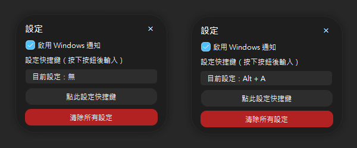

# **Warframe 配對阻斷器**

  

透過限制特定 UDP 端口輸出來強制成為主機，避免加入其他玩家的主機，確保你成為遊戲的主機。

> 若你想要在開放世界成為主機，你只要先將隊伍調整成非公開，進入載入的期間調整成公開即可，不必依賴此工具。

## 📥 **下載**

👉 [**Windows 執行檔 點我下載**](https://github.com/MeowXiaoXiang/WarframePairBlockTool/releases/download/v3.0.0/WarframePairBlockTool.exe "下載 v3.0.0 版本")

## 📋 **功能特色**

- **全新 PySide6 介面**：使用 PySide6 框架重寫，提供更現代化的使用者體驗
- **系統列支援**：最小化至右下角系統列，不影響操作系統使用
- **快捷鍵支援**：可設定全局快捷鍵快速切換配對狀態
- **自訂阻斷端口**：用戶可以選擇要阻斷的 UDP 端口，工具設計上支持自定義端口
- **自動解除阻斷**：預設 20 秒後解除阻斷，避免長時間阻斷影響 P2P 連線的穩定性
- **自動請求系統管理員權限**：工具啟動時會自動請求系統管理員權限，以便修改防火牆規則
- **主題適應**：自動適應 Windows 10/11 的明亮/深色主題設定
- **不進行遊戲注入**：本工具僅通過控制 Windows 防火牆來達成目的，不會對遊戲進行任何注入操作

## 🆕 **v3.0.0 版本更新**

- 從 Tkinter 遷移到 PySide6 框架
- 全新的現代化使用者介面
- 新增右下角系統列功能
- 支援全局快捷鍵
- 新增主題適應功能，自動跟隨系統主題切換明暗模式
- 重構專案結構，提高可維護性
- 增強系統通知功能
- 改進錯誤處理機制

## 🚀 **如何使用**

1. **啟動工具**：

   - 雙擊 `WarframePairBlockTool.exe`，工具會自動請求系統管理員權限以修改防火牆規則。
2. **開始阻斷配對**：

   - 點擊「**配對正常**」按鈕，阻斷 UDP 埠（4950 和 4955 或您在工具中選擇的埠），確保你成為主機。
   - 按鈕會變為「**配對已阻斷**」狀態，表示阻斷已生效。
3. **自動解除阻斷**：

   - 預設阻斷 20 秒後自動解除。你也可以在工具中調整所需的阻斷時間。
4. **右下角系統列操作**：

   - 關閉視窗後程式會自動最小化到右下角系統列
   - 在系統列圖示上右鍵可以看到快捷操作選單

## 🛠️ **打包說明**

1. **安裝依賴套件**：在終端機中執行以下指令：

   ```bash
   pip install -r requirements.txt
   ```

2. **打包程式**：在專案根目錄下輸入以下指令：

   ```bash
   pyinstaller build.spec --noconfirm --clean
   ```

3. **查看打包結果**：
   打包完成後，檔案會存放於 `dist` 資料夾內。

## 🖼️ **使用介面示意圖**

### 主介面展示


本工具提供「正常模式」、「配對阻斷」與「UDP 埠選擇」三種主要互動狀態：

- ✅ **左側**：正常狀態，按鈕為綠色，代表目前未進行封鎖
- ❌ **中間**：阻斷狀態，按鈕變為紅色，表示目前封鎖中
- 🔽 **右側**：展開 UDP 埠下拉選單以選擇適用的埠段

---

### 托盤功能與狀態顯示


透過系統托盤圖示，您可以快速執行：

- 顯示/隱藏主視窗
- 切換阻斷狀態
- 快速查看當前配對狀態（包含綠燈 / 紅燈）
- 一鍵開啟 Windows 防火牆管理介面

---

### 設定面板



此視窗可讓使用者快速調整功能偏好：

- ✅ **左側**：未設定任何快捷鍵，僅啟用 Windows 通知功能
- 🎯 **右側**：已設定快捷鍵（如 `Alt + A`），可用於快速切換阻斷狀態
- 🔁 可點擊按鈕重新設定快捷鍵，或使用下方按鈕**一鍵清除所有設定**

---

### 通知效果展示


當以下狀況發生時，工具會透過 Windows 通知中心即時提示使用者：

- 🎯 快捷鍵設定成功（如：`Alt + A`）
- 📥 程式最小化至系統托盤
- ❌ 配對阻斷啟動（顯示封鎖的 UDP 埠）
- ✅ 配對恢復（自動或手動解除阻斷）

> ⚠️ 注意：通知顯示效果將受 Windows 系統設定影響。
> 若您啟用了「專注輔助」、「勿擾模式」或「遊戲模式」，通知可能不會即時彈出，但仍會顯示於通知中心中。

## ❓ **常見問題與注意事項**

1. **無法成為主機？**

   - 檢查防火牆是否有名為「WarframePairBlockPort」的輸出封鎖規則
   - 確保工具中選擇的UDP端口與遊戲內設定相符（可在 Warframe 中的 選項 → 系統 → 網路連接埠[UDP] 查看）
   - 確認你的系統允許遊戲的 P2P 連線
2. **阻斷後看不到其他玩家？**

   - 過長的阻斷時間可能導致同步問題。
   - 使用工具的**自動回復配對**功能來避免此問題。
3. **防毒軟體阻擋執行檔？**

   - 若遇到防毒軟體警告，將工具加入信任清單即可。
4. **找不到右下角系統列圖示？**

   - 檢查 Windows 任務欄右下角的隱藏圖示區域。
   - 確保程式已啟動且未被系統終止。

## 🤝 **貢獻與支援**

若有任何問題或建議，請在 GitHub 上提交 Issue 或 Pull Request。
